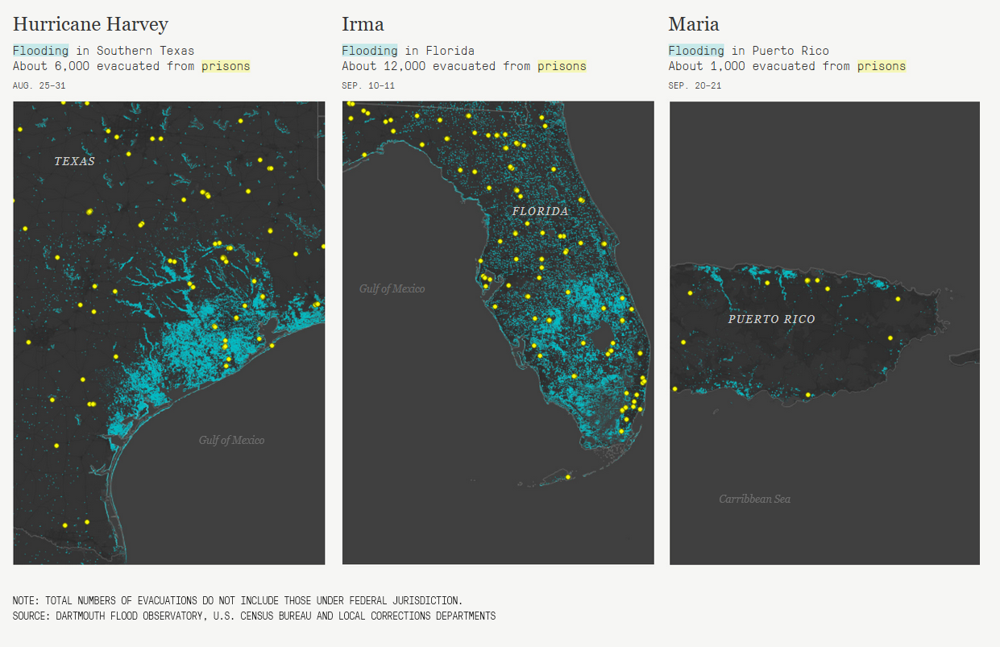

## Prisons and the Deluge

This repository contains data and scripts used for the first assignment of [PLAN 672- Urban Data Analytics in R](https://nkaza.github.io/teaching/techniques-course/), at the University of North Carolina at Chapel Hill  

### About 

In 2017 the [Marshall Project](https://www.themarshallproject.org/2017/10/20/prisons-and-the-deluge) mapped prison locations in Florida, southern Texas, and Puerto Rico and their vulnerability to flooding with reference to specific hurricanes that made landfall.  While officials had dismissed the anecdotal accounts from inmates that cells had experienced flooding, a comparative analysis of prison locations with data from the [Dartmouth Flood Observatory](https://floodobservatory.colorado.edu/Archives/index.html) showed that the areas surrounding several prison facilities did in fact flood. 

**Objectives**

For this assignment, we will first critique the existing set of static data visualizations created by the Marshall Project, and suggest alternatives/changes that present the story more effectively. 
Second, we will use the publicly available data mapped by the Marshall Project to explore the feasibility of alternative visualizations. Specifically, we aim to expand the analysis conducted by the Marshall Project to multiple states and disasters, further stratify the risk of flooding presented in their report, explore how these data intersect with population demographics and socio-economic data in the areas surrounding correctional facilities, and create an interactive version of their static maps.

---
## Project structure 

  - `./scripts/` contains all the scripts needed to reproduce the analysis. The scripts are intended to be run in order of their number.
  - `./source_data/` contains publicly-available data used in the analytic pipeline.
  - `./figures/` contains all the original source visualizations, and processed visualizations that result from the `./scripts/` pipeline.
  - `./derived_data/` contains all processed data that results from our `./scripts/` pipeline.
---

### Notes

**Acknowledgements**
This project is dedicated to Nicolette Green and Wendy Newton, who were left to drown in the back of a transport van amid rising floodwaters from Hurricane Florence in September 2018. Their loss of life was preventable, and was a direct result of the broken criminal justice system in the United States which continuous to violate fundamental human rights and disproportionately harm vulnerable populations and communities of color.

**Issues**

Please report issues to the [issues page](https://github.com/abhatia08/plan672-assignment1/issues).

---
## Authors
- [Mad Bankson](https://www.linkedin.com/in/bankson/) (: [breadnroses](https://github.com/breadnroses))

- [Abhishek Bhatia](https://abhatia.me/) (: [abhatia08](https://github.com/abhatia08)) 

- [Pierce Holloway](https://hollowaypierce.github.io/) (: [hollowaypierce](https://github.com/hollowaypierce)) 
